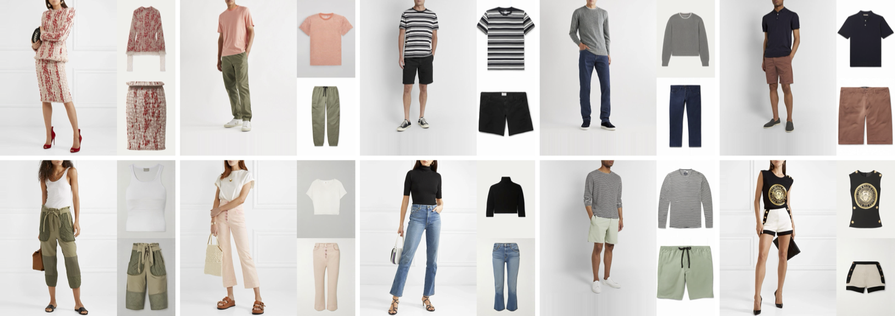

<!-- PROJECT LOGO -->
<br />
<div align="center">
   <h1 align="center">TEMU-VTOFF</h1>
      <h3 align="center"> Text-Enhanced MUlti-category Virtual Try-Off</h3>
</div>

<div align="center">
  <picture>
    <source srcset="assets/teaser.png" media="(prefers-color-scheme: dark)">
      
    </source>
  </picture>
</div>

<div align="center">

> **Inverse Virtual Try-On: Generating Multi-Category Product-Style Images from Clothed Individuals**
> [Davide Lobba](https://scholar.google.com/citations?user=WEMoLPEAAAAJ&hl=en&oi=ao)<sup>1,2,\*</sup>, [Fulvio Sanguigni](https://scholar.google.com/citations?user=tSpzMUEAAAAJ&hl=en)<sup>2,3,\*</sup>, [Bin Ren](https://scholar.google.com/citations?user=Md9maLYAAAAJ&hl=en)<sup>1,2</sup>, [Marcella Cornia](https://scholar.google.com/citations?user=DzgmSJEAAAAJ&hl=en)<sup>3</sup>, [Rita Cucchiara](https://scholar.google.com/citations?user=OM3sZEoAAAAJ&hl=en)<sup>3</sup>, [Nicu Sebe](https://scholar.google.com/citations?user=stFCYOAAAAAJ&hl=en)<sup>1</sup>
> <sup>1</sup>University of Trento, <sup>2</sup>University of Pisa, <sup>3</sup>University of Modena and Reggio Emilia
> <sup>\*</sup> Equal contribution

</div>

<div align="center">
  <a href="https://arxiv.org/abs/2505.21062" style="margin: 0 2px;">
    
  </a>
  <a href="https://arxiv.org/pdf/2505.21062" style="margin: 0 2px;">
    
  </a>
  <a href='https://temu-vtoff-page.github.io/' style="margin: 0 2px;">
    
  </a>
  <a href="https://huggingface.co/davidelobba/TEMU-VTOFF">
    
  </a>
  <a href="https://raw.githubusercontent.com/davidelobba/TEMU-VTOFF/refs/heads/main/LICENSE" style="margin: 0 2px;">
    
  </a>
</div>

<!-- TABLE OF CONTENTS -->
<details>
<summary>Table of Contents</summary>
<ol>
  <li><a href="#-about-the-project">About The Project</a></li>
  <li><a href="#-key-features">Key Features</a></li>
  <li><a href="#-getting-started">Getting Started</a>
    <ul>
      <li><a href="#prerequisites">Prerequisites</a></li>
      <li><a href="#installation">Installation</a></li>
    </ul>
  </li>
  <li><a href="#inference">Inference</a></li>
  <li><a href="#dataset-inference">Dataset Inference</a></li>
  <ul>
      <li><a href="#dataset-captioning">Dataset Captioning</a></li>
      <li><a href="#feature-extraction">Feature Extraction</a></li>
      <li><a href="#generate-images">Generate Images</a></li>
    </ul>
  <li><a href="#-contact">Contact</a></li>
  <li><a href="#citation">Citation</a></li>
</ol>
</details>

<!-- ABOUT THE PROJECT -->

## 💡 About The Project

TEMU-VTOFF is a novel dual-DiT (Diffusion Transformer) architecture designed for the Virtual Try-Off task: generating clean, in-shop images of garments worn by a person. By combining a pretrained feature extractor with a text-enhanced generation module, our method can handle occlusions, multiple garment categories, and ambiguous appearances. It further refines generation fidelity via a feature alignment module based on DINOv2.

## ✨ Key Features

Our contribution can be summarized as follows:

- **🎯 Multi-Category Try-Off**. We present a unified framework capable of handling multiple garment types (upper-body, lower-body, and full-body clothes) without requiring category-specific pipelines.
- **🔗 Multimodal Hybrid Attention**. We introduce a novel attention mechanism that integrates garment textual descriptions into the generative process by linking them with person-specific features. This helps the model synthesize occluded or ambiguous garment regions more accurately.
- **⚡ Garment Aligner Module**. We design a lightweight aligner that conditions generation on clean garment images, replacing conventional denoising objectives. This leads to better alignment consistency on the overall dataset and preserves more precise visual retention.
- **📊 Extensive experiments**. Experiments on the Dress Code and VITON-HD datasets demonstrate that TEMU-VTOFF outperforms prior methods in both the quality of generated images and alignment with the target garment, highlighting its strong generalization capabilities.

<!-- GETTING STARTED -->

## 💻 Getting Started

### Prerequisites

Clone the repository:

```sh
git clone https://github.com/davidelobba/TEMU-VTOFF.git
```

### Installation

1. We recommend installing the required packages using Python's native virtual environment (venv) as follows:
   ```sh
   python -m venv venv
   source venv/bin/activate
   ```
2. Upgrade pip and install dependencies
   ```sh
   pip install --upgrade pip
   pip install -r requirements.txt
   ```
3. Create a .env file like the following:
   ```js
   export WANDB_API_KEY="ENTER YOUR WANDB TOKEN"
   export HF_TOKEN="ENTER YOUR HUGGINGFACE TOKEN"
   export HF_HOME="PATH WHERE YOU WANT TO SAVE THE HF MODELS"
   ```
   🧠 Note: Access to Stable Diffusion 3 Medium must be requested via [HuggingFace](https://huggingface.co/stabilityai/stable-diffusion-3-medium-diffusers).

## Inference

Let's generate the in-shop garment image.

```sh
source venv/bin/activate
source .env

python inference.py \
    --pretrained_model_name_or_path "stabilityai/stable-diffusion-3-medium-diffusers" \
    --pretrained_model_name_or_path_sd3_tryoff "davidelobba/TEMU-VTOFF" \
    --seed 42 \
    --width "768" \
    --height "1024" \
    --output_dir "./out" \
    --example_image "examples/example1.jpg" \
    --guidance_scale 2.0 \
    --num_inference_steps 5
```

## Dataset Inference

### Dataset Captioning

Generate textual descriptions for each sample using a multimodal VLM (e.g., Qwen2.5-VL).

```sh
python precompute_utils/captioning_qwen.py \
            --pretrained_model_name_or_path "Qwen/Qwen2.5-VL-7B-Instruct" \
            --dataset_name "dresscode" \
            --dataset_root "put here your dataset path" \
            --filename "qwen_captions_2_5.json"\
            --temperatures 0.2
```

### Feature extraction

Extract textual features using OpenCLIP, CLIP and T5 text encoders.

```sh
phases=("test" "train")
for phase in "${phases[@]}"; do
   python precompute_utils/precompute_text_features.py \
               --pretrained_model_name_or_path "stabilityai/stable-diffusion-3-medium-diffusers" \
               --dataset_name "dresscode" \
               --dataset_root "put here your dataset path" \
               --phase $phase \
               --order "paired" \
               --category "all" \
               --output_dir "" \
               --seed 42 \
               --height 1024 \
               --width 768 \
               --batch_size 4 \
               --mixed_precision "fp16" \
               --num_workers 8 \
               --text_encoders "T5" "CLIP" \
               --captions_type "qwen_text_embeddings"
```

Extract visual features using OpenCLIP and CLIP vision encoders.

```sh
phases=("test" "train")
for phase in "${phases[@]}"; do
   python precompute_utils/precompute_image_features.py \
               --dataset "dresscode" \
               --dataroot "put here your dataset path" \
               --phase $phase \
               --order "paired" \
               --category "all" \
               --seed 42 \
               --height 1024 \
               --width 768 \
               --batch_size 4 \
               --mixed_precision "fp16" \
               --num_workers 8
```

### Generate Images

Let's generate the in-shop garment images of DressCode or VITON-HD using the TEMU-VTOFF model.

```sh
source venv/bin/activate
source .env

python inference_dataset.py \
    --pretrained_model_name_or_path "stabilityai/stable-diffusion-3-medium-diffusers" \
    --pretrained_model_name_or_path_sd3_tryoff "davidelobba/TEMU-VTOFF" \
    --dataset_name "dresscode" \
    --dataset_root "put here your dataset path" \
    --output_dir "put here the output path" \
    --coarse_caption_file "qwen_captions_2_5_0_2.json" \
    --phase "test" \
    --order "paired" \
    --height "1024" \
    --width "768" \
    --mask_type bounding_box \
    --category "all" \
    --batch_size 4 \
    --mixed_precision "bf16" \
    --seed 42 \
    --num_workers 8 \
    --fine_mask \
    --guidance_scale 2.0 \
    --num_inference_steps 28
```

## 📬 Contact

**Lead Authors:**

- 📧 **Davide Lobba**: [davide.lobba@unitn.it](mailto:davide.lobba@unitn.it) | 🎓 [Google Scholar](https://scholar.google.com/citations?user=WEMoLPEAAAAJ&hl=en&oi=ao)
- 📧 **Fulvio Sanguigni**: [fulvio.sanguigni@unimore.it](mailto:fulvio.sanguigni@unimore.it) | 🎓 [Google Scholar](https://scholar.google.com/citations?user=tSpzMUEAAAAJ&hl=en)

For questions about the project, feel free to reach out to any of the lead authors!

## Citation

Please cite our paper if you find our work helpful:

```bibtex
@article{lobba2025inverse,
  title={Inverse Virtual Try-On: Generating Multi-Category Product-Style Images from Clothed Individuals},
  author={Lobba, Davide and Sanguigni, Fulvio and Ren, Bin and Cornia, Marcella and Cucchiara, Rita and Sebe, Nicu},
  journal={arXiv preprint arXiv:2505.21062},
  year={2025}
}
```
